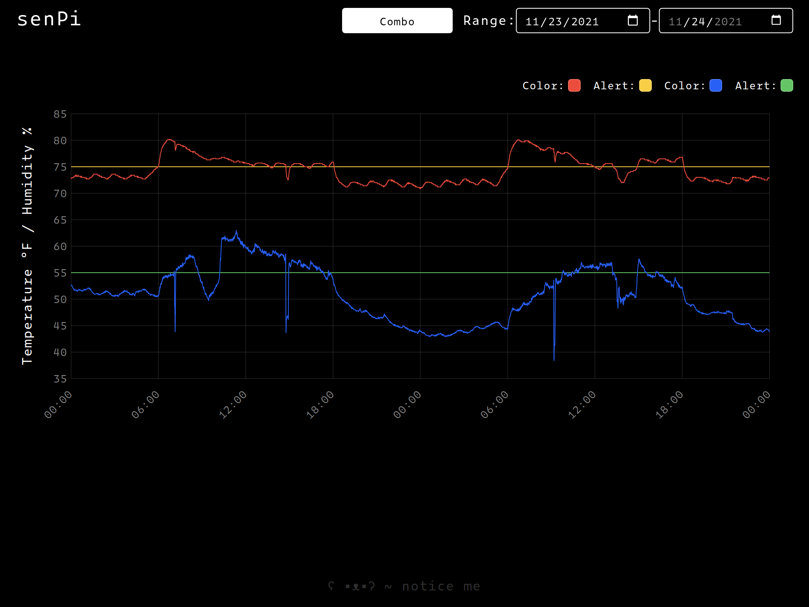

# Sensor Logging

This app was created for logging and visualizing temperature and humidity data using a Raspberry Pi and a DHT22 module. It also features an optional IFTTT notification for high temperature alerts, which can be defined in the script config.



## Hardware Requirements

- Raspberry Pi (3B or better recommended)
- DHT22 Module

## Software Requirements

- Node (Installed via nvm)
- Python3

## Setup

This guide assumes you're already familiar with installing [Raspberry Pi OS](https://www.raspberrypi.org/software/) (formly known as Raspbian) and have already installed [Node](https://www.nodejs.org) via nvm. Setting up the project is fairly straight forward:

1. Setup python script
2. Build web server
3. Create systemd service

### 1. Setup python script

**Please note:** This script requires the [Adafruit_DHT](https://github.com/adafruit/Adafruit_Python_DHT) library. Please note this library has been **deprecated**, so use with caution. To get started open a new terminal and run:

```bash
sudo pip3 install Adafruit_DHT
```

Next you'll need to create a `config.ini`. To use the provided example open a terminal, navigate to the repo directory, and run the following command:

```bash
cp config-sample.ini config.ini
```

Once created, open the config and confirm that `DHT_PIN` is set to the correct GPIO number on your Raspberry Pi (not the pin number itself). For example I use GPIO #14, but on the Raspberry Pi it's pin #7.

The last step is to create a cron job. In a terminal run `crontab -e`, and append the following line at the bottom:

```bash
* * * * * python3 sensors/sensors.py
```

Data will be logged to `./data` every minute in CSV format.

#### IFTTT (optional)

To enable IFTTT webhook notifications, open your config and under the [ifttt] section set `ENABLED` to `1` or `TRUE`, provide your `KEY` and `EVENT` name, and set `WARNING_TEMP` to the desired value.

### 2. Build web server

Once you've completed script setup the next step is to install the web server dependencies and build the frontend application. In terminal navigate to `./server` and run `npm i` to install the server dependencies.

Navigate to the `./server/client` directory and run the `npm i` command again to install the frontend client dependencies.

Lastly, while still in the `./server/client` directory run `npm run build` to build the frontend client app.

### 3. Create systemd service

Open `./rpisensors.service` and make sure that the `ExecStart` and `User` options are correct.

Copy `./rpisensors.service` to `/etc/systemd/system/rpisensors.service` by opening a terminal, navigating to the project root directory, and running:

```bash
sudo cp sensors.service /etc/systemd/system/rpisensors.service
```

Since nvm will manage our node/npm versions a simple shell script is used to properly create the service, which can be found in `start.sh`. This script **must** be executable by running `chmod +x /path/to/script/start.sh`

All that's left is enabling and starting our new service with the following commands:

```bash
systemctl enable rpisensors
systemctl start rpisensors
```

To check that the service started properly run `systemctl status rpisensors`.

And that's it! You can now view the frontend by navigating to your rPi's IP address on port `5000` (or whichever port is defined in your `PORT` environment variable).

Special thanks to [joepie91](https://github.com/joepie91) for their guide on [running a Node.js application using nvm as a systemd service](https://gist.github.com/joepie91/73ce30dd258296bd24af23e9c5f761aa)!